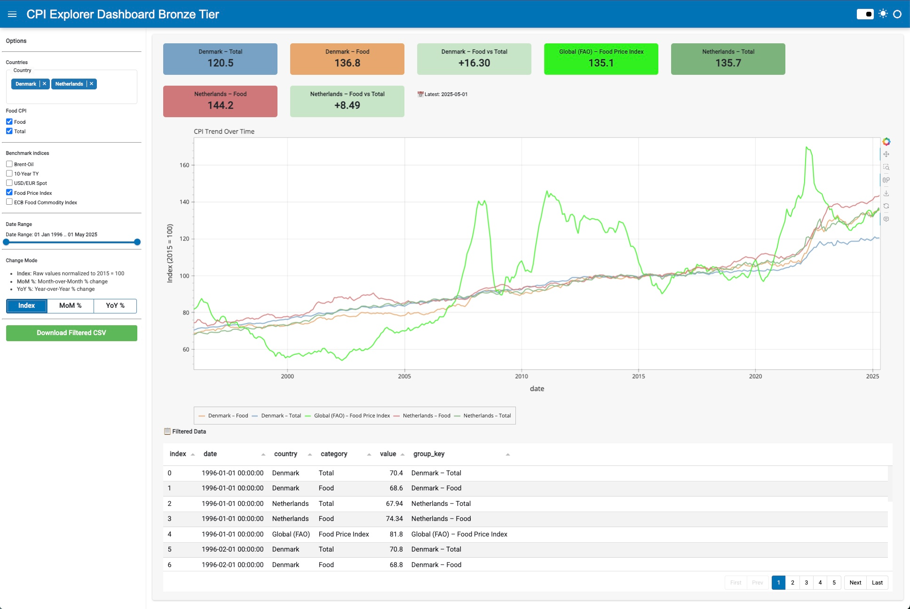

# 📈 CPI Explorer Dashboard (Bronze Tier)

An interactive and extensible dashboard for exploring **Consumer Price Index (CPI)** trends in **Denmark** and **Netherlands**, alongside selected **global economic benchmarks**.

Built using:
- ⚡️ [Polars](https://www.pola.rs/) for fast data handling
- 📊 [HvPlot](https://hvplot.holoviz.org/) & [Holoviews](https://holoviews.org/) for plotting
- 📦 [Panel](https://panel.holoviz.org/) for UI/dashboarding

---

## 🚀 Features

- 📅 **Interactive time filtering** with support for:
  - Raw index (2015 = 100)
  - Month-over-month (% change)
  - Year-over-year (% change)

- 🏷 **Filterable categories**:
  - CPI categories: `Food`, `Total`
  - Benchmarks: `Brent Oil`, `10Y US Treasury`, `USD/EUR`, `FAO Food Index`, `ECB Commodity Index`

- 📊 **Dynamic KPI Cards** for latest values per series
- 📥 **Export filtered data** to CSV
- 🎨 **Color-coded legend**, responsive layout, hover tooltips
- 🌗 **Panel theme support** (light/dark toggle)
- 💡 **Features section** no internet needed — uses local CSVs


---

## 📁 Data Sources

| Dataset                       | Source                         | Note                         |
|------------------------------|--------------------------------|------------------------------|
| CPI (Food, Total)            | [Eurostat / FRED]              | Normalized to 2015 = 100     |
| Brent Oil Price              | [FRED](https://fred.stlouisfed.org/series/MCOILBRENTEU)         | Median-adjusted              |
| US 10-Year Treasury Yield    | [FRED](https://fred.stlouisfed.org/series/GS10)                 | Global interest benchmark    |
| USD/EUR Exchange Rate        | [FRED](https://fred.stlouisfed.org/series/EXUSEU)               | Inverted to EUR              |
| FAO Food Price Index         | [FAO](https://www.fao.org/worldfoodsituation/foodpricesindex/)  | Monthly, rebased to 2015     |
| ECB Food Commodity Index     | [ECB](https://data.ecb.europa.eu/)                              | STS.M.I9.N.ECPE.CFOOD0.3.000 |

> All time series are aligned by date and normalized to allow fair comparison.

### 📊 Consumer Price Index (HICP) – Data Files

| Filename                     | Country       | Category          | Frequency | Base Year | Description                                 |  URL                                                                                    |
|------------------------------|---------------|-------------------|-----------|-----------|---------------------------------------------|-----------------------------------------------------------------------------------------|
| CP0000DKM086NEST.csv         | Denmark       | All Items (Total) | Monthly   | 2015=100  | Denmark's overall Harmonized CPI            |https://fred.stlouisfed.org/graph/fredgraph.csv?id=CP0000DKM086NEST                      |
| CP0000NLM086NEST.csv         | Netherlands   | All Items (Total) | Monthly   | 2015=100  | Netherlands' overall Harmonized CPI         |https://fred.stlouisfed.org/graph/fredgraph.csv?id=CP0000NLM086NEST                      |
| CP0110DKM086NEST.csv         | Denmark       | Food & Beverages  | Monthly   | 2015=100  | Denmark's food-specific Harmonized CPI      |https://fred.stlouisfed.org/graph/fredgraph.csv?id=CP0110DKM086NEST                      |
| CP0110NLM086NEST.csv         | Netherlands   | Food & Beverages  | Monthly   | 2015=100  | Netherlands' food-specific Harmonized CPI   |https://fred.stlouisfed.org/graph/fredgraph.csv?id=CP0110NLM086NEST                      |
| MCOILBRENTEU.csv             | Global        | Oil Brent         | Monthly   | 2015=100  | Crude Oil Brent - produced in the North Sea |https://fred.stlouisfed.org/series/MCOILBRENTEU  - manual selection                      |
| GS10.csv                     | USA           | 10-Year Treasury  | Monthly   | 2015=100  | U.S. 10-Year Treasury Yield.                |https://fred.stlouisfed.org/series/GS10  - manual selection                              | 
| EXUSEU.csv                   | Global        | USD/EUR Spot      | Monthly   | 2015=100  | USD/EUR Spot                                |https://fred.stlouisfed.org/series/EXUSEU  - manual selection                            |
| food_price_ind..._jul25.csv  | Global        | Global (FAO)      | Monthly   | 2015=100  | Food Price Index                            |https://www.fao.org/worldfoodsituation/foodpricesindex/en - manual selection             |
| STS_M_I9_N_ECPE...3_000.csv  | EU            | Global (FAO)      | Monthly   | 2015=100  | ECB Food Commodity Index                    |https://sdw-wsrest.ecb.europa.eu/service/data/STS/M.I9.N.ECPE.CFOOD0.3.000?format=csvdata|
---
## 🧰 Setup

Follow these steps to get the **CPI Explorer Dashboard** running locally.

```bash
# 1. Clone the repository
git clone https://github.com/python-dev-bg/freelance-portfolio.git
cd freelance-portfolio/CPI-Explorer/bronze-tier

# 2. Create and activate a virtual environment in root level (outside 'CPI Explorer' folder)

# On Linux/macOS:
python -m venv venv # or python3 -m venv venv
source venv/bin/activate

# On Windows (CMD):
python -m venv venv
.\venv\Scripts\activate

# If using PowerShell and you see a permissions error:
Set-ExecutionPolicy -Scope Process -ExecutionPolicy Bypass

# 3. Install dependencies
pip install -r requirements.txt

# Optional for conda users:
conda env create -f environment.yml

# 4. Run the dashboard (must be inside the bronze-tier folder)
panel serve main.py --show

# 5. Stop with:
Ctrl+C
```
The app should automatically open in your browser.  
If not, visit: http://localhost:5006/app
