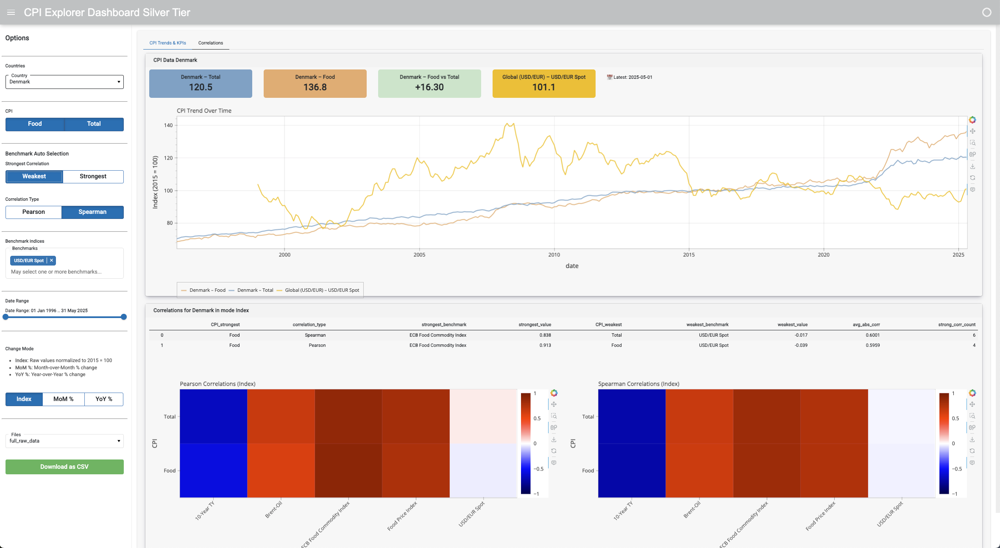
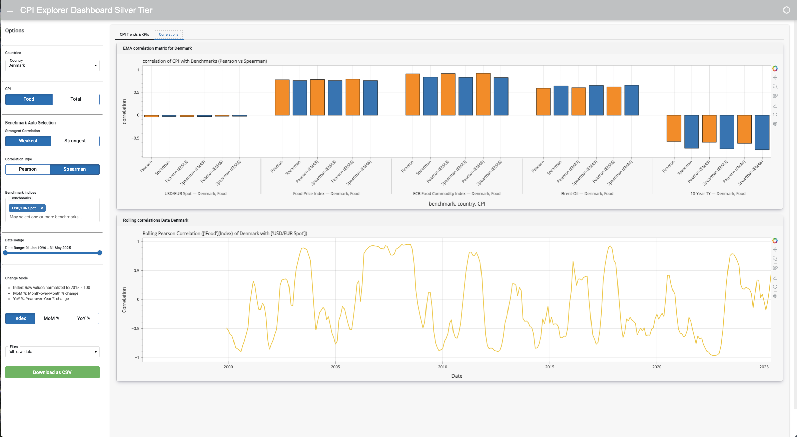

# 🌟 CPI Explorer – Silver Tier

## Overview
The Silver-tier CPI Explorer builds on the Bronze version by introducing advanced analytical features to evaluate the relationship between national Food CPI trends and major economic benchmarks.

It is designed for researchers, analysts, and policymakers seeking:
- real-time CPI benchmark insight
- dynamic correlation tracking
- quick access to downloadable data

---

## 📊 Features

### ✔️ CPI Trends (Tab 1)
- Line plots of CPI time series for selected countries and categories
- Modes: Raw Index, Month-over-Month %, Year-over-Year %
- EMA smoothing (3- and 6-month) to clarify noisy trends

### ✔️ Correlation Analysis (Tab 2)
- Pearson & Spearman correlation bars (raw and smoothed)
- Correlation heatmaps (12-month rolling)
- KPI cards showing strongest/weakest benchmarks
- Toggle between correlation type and strength filters

### ✔️ Data Downloads (Sidebar)
- Users can now download CSV exports of:
  - ✉️ `full_raw_data_YYYY-MM-DD_HH-MM.csv`
  - ✉️ `full_correlations_data_YYYY-MM-DD_HH-MM.csv`
  - ✉️ `strongest_weakest_correlations_YYYY-MM-DD_HH-MM.csv`

All files reflect the user's current selections and are served with a timestamped filename.

---


## 🚀 Features

### ✅ Dataset Coverage

- **Countries**: Denmark, Netherlands
- **CPI Categories**: Food, Total
- **Benchmarks**:
  - Brent Oil
  - USD/EUR exchange rate
  - 10-Year US Treasury Yields
  - FAO Food Index
  - ECB Food Commodity Index

### 📊 Analytical Modes

- **Index**: Raw values rebased to 2015 = 100
- **MoM %**: Monthly percentage change
- **YoY %**: Year-over-year percentage change

### 📈 Correlation Analysis

- **Pearson**: Measures linear correlation
- **Spearman**: Measures monotonic rank correlation
- **Rolling Correlation**: Time-evolving correlation window (default 12 months)
- **EMA Smoothing**: Reduces noise with Exponential Moving Average


## ⚙️ Technical Implementation

### 1. Data Pipeline
- Input: Static CSV + live FRED/FAO/ECB downloads
- Preprocessing: Polars-based ETL to unify date range and formats
- Output: Polars DataFrames merged on date + category + country

### 2. EMA Computation
- 3- and 6-month exponential moving averages using `pl.ewm_mean()`
- Used in both trend plots and correlation comparisons
### 🧠 Why EMA?

**EMA (Exponential Moving Average)** is used to reduce noise in economic time series:

- Highlights **persistent trends** by giving more weight to recent observations
- Enables **correlation smoothing** in turbulent markets
- Used for **EMA3** and **EMA6** smoothing spans

This significantly improves the **signal quality** in both Pearson and Spearman correlations.

---

### 3. Correlation Engine
- Computes Pearson/Spearman for:
  - raw CPI & benchmarks
  - EMA3 CPI & EMA3 benchmarks
  - EMA6 CPI & EMA6 benchmarks
- Outputs:
  - Full matrix of correlations
  - KPI subset: strongest/weakest benchmark per category

### 4. Rolling Correlation
- Rolling Pearson window = 12 months
- Indexed by benchmark and CPI type
- Reveals temporal dynamics in benchmark sensitivity

### 5. UI with Panel
- Uses `pn.Tabs` for multi-panel layout
- Interactive controls:
  - Country, CPI type(s), correlation type/strength, date range
- Responsive layout with `sizing_mode="stretch_width"`
- Notifications and download enabled via `pn.state.notifications`

---

## 🚀 Quick Start

```bash
# 1. Clone the repo
https://github.com/python-dev-bg/freelance-portfolio.git
cd freelance-portfolio/CPI-Explorer/silver-tier

# 2. Create and activate virtual environment
python -m venv venv
source venv/bin/activate        # macOS/Linux
# .\venv\Scripts\activate       # Windows

# 3. Install dependencies
pip install -r requirements.txt

# 4. Run the app
python main.py
```

Then open your browser to: [http://localhost:5007](http://localhost:5007)

---

## 📄 Requirements
- Python 3.10+
- Dependencies: Panel, Polars, Requests, Pandas (for compatibility)

---

## 🔗 Repository Structure
```
ilver-tier/
├── main.py                     # Entrypoint — launches the Panel app
├── requirements.txt            # Python dependencies
├── README.md                   # Project documentation
└── src/
    ├── init.py
    ├── bindings.py             # Reactive bindings between widgets and plots
    ├── card_manager.py         # Manages dynamic KPI cards
    ├── config.py               # Static configuration for UI and modes
    ├── dashboards_factory.py   # Creates tabs and layout dynamically
    ├── data_loader.py          # Handles data ingestion from files or cache
    ├── data_processor.py       # Computes correlations, EMA, rolling stats
    ├── logger.py               # Suppresses and manages Bokeh/Panel logs
    ├── plotter.py              # Contains all visual plots (line, heatmaps, bars)
    ├── utils.py                # Utility functions (formatters, helpers)
    └── widgets.py              # Panel widgets and selectors
```

---
## 📥 Data Source Info

Some files are directly bundled, others are downloaded automatically if available:

- [x] `data/` folder includes raw CPI, benchmark data
- [x] `data_loader.py` supports **automated downloading** from ECB/FAO/FRED URLs where enabled

---


## 🚨 Notes
- If internet is unavailable, the app will gracefully fall back to local CSV
- Only food CPI categories are included for now (extendable)

---

## 📗 License
MIT License — open to reuse and extension.

---

## 🎓 Credits
Built by [@python-dev-bg](https://github.com/python-dev-bg) using:
- [Panel](https://panel.holoviz.org/)
- [Polars](https://pola.rs/)
- [FRED](https://fred.stlouisfed.org/), [FAO](https://www.fao.org), [ECB](https://www.ecb.europa.eu/)
